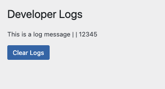

# Developer Logs Plugin



**Developer Logs Plugin** is a WordPress plugin that provides a simple and effective way to log custom developer logs. This plugin allows you to log messages, arrays, and other data types from anywhere in your WordPress site. The logs are displayed on a dedicated settings page in the WordPress admin area and can be cleared with a single click.

## Features

- **Log Any Data:** Easily log strings, arrays, objects, and more from your WordPress codebase.
- **AJAX-Driven UI:** View and clear logs on the settings page without reloading the page.
- **Secure:** Follows WordPress best practices for security, including sanitization, validation, and nonces.

## Installation

1. **Upload the Plugin:**
   - Download the plugin from the link provided below.
   - Upload the `developer-logs-plugin` folder to the `/wp-content/plugins/` directory.

2. **Activate the Plugin:**
   - Go to the 'Plugins' menu in WordPress and activate the **Developer Logs Plugin**.

3. **Start Logging:**
   - Use the `Dev_Logs_Logger::log()` method in your code to log data.

## Usage

### Logging Data

To log data from anywhere in your WordPress code, use the `Dev_Logs_Logger::log()` method. This method accepts multiple arguments and logs them together.

```php
Dev_Logs_Logger::log('This is a log message', array('key' => 'value'), 12345);
```

### Viewing Logs

1. Go to the WordPress admin dashboard.
2. Navigate to `Settings > Developer Logs` to view the logs.

### Clearing Logs

Click the "Clear Logs" button on the `Developer Logs` settings page to clear all logs.

## File Structure

```
developer-logs-plugin/
│
├── assets/
│   └── js/
│       └── dev-logs-plugin.js
│
├── templates/
│   └── admin-page.php
│
├── includes/
│   ├── class-dev-logs-plugin.php
│   ├── class-dev-logs-logger.php
│   └── class-dev-logs-settings-page.php
│
├── uninstall.php
│
└── developer-logs-plugin.php
```

## License

This plugin is licensed under the [MIT License](https://opensource.org/licenses/MIT).
